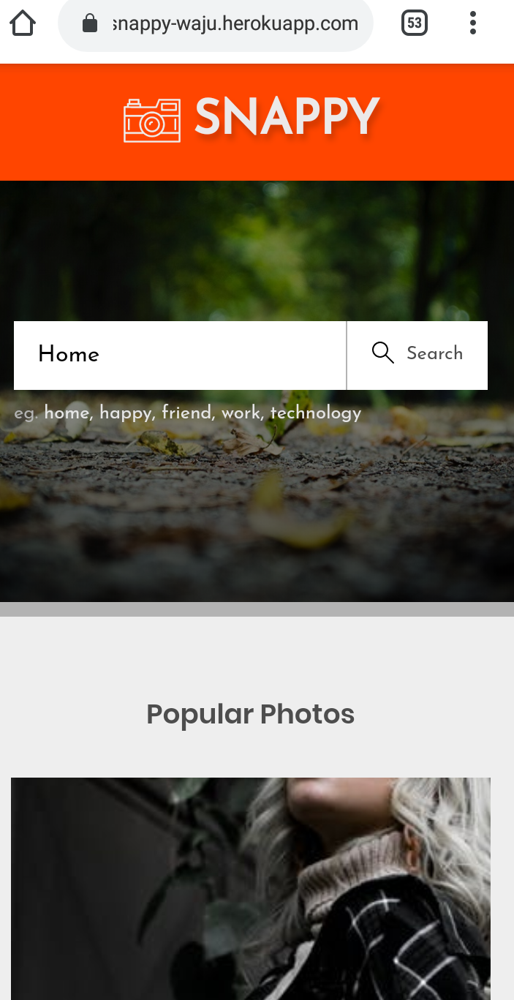

# SNAPPY




## WHAT ?

Snappy is a demo project that functions as a image search service powered by the good folks at [Pexels](https://pexels.com)

## Features

While just a demo, Snappy boasts a few neat features.

- It's a PWA (Progressive Web App) which can be installed on Android and iOS devices as-a native app

- Using some nice caching technique, already loaded pages in a paginated result is can be viewed without refreshing.

- The App boasts a clean and minimalist UI that just works.

## Running it locally

```
yarn install # or npm install
```

### Compiles and hot-reloads for development

```
yarn run serve
```

### Compiles and minifies for production

```
yarn run build
```

### Lints and fixes files

```
yarn run lint
```
